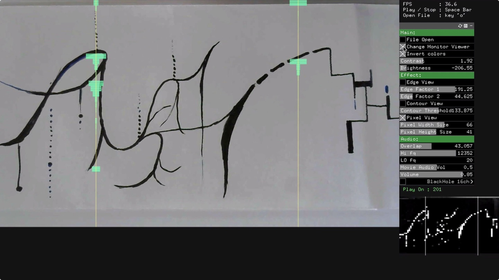
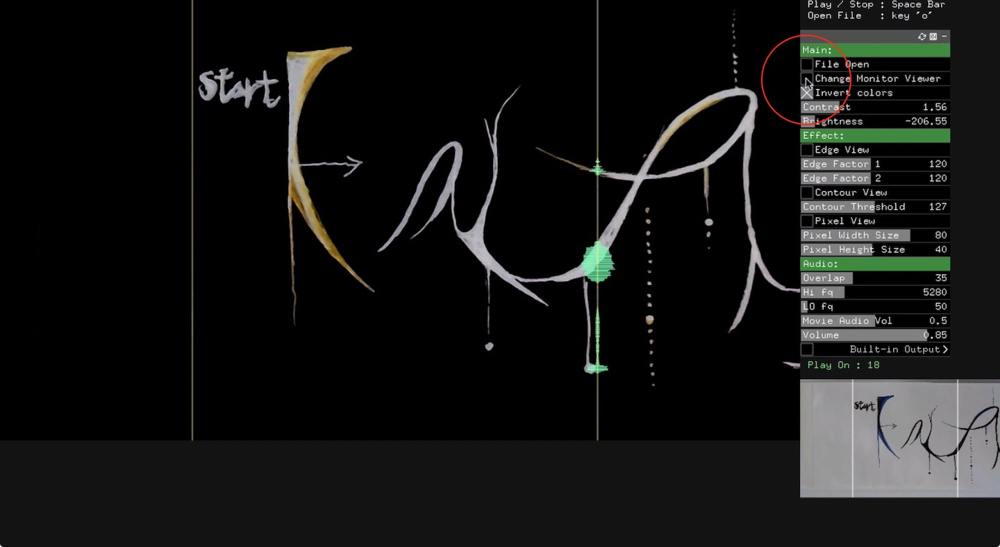
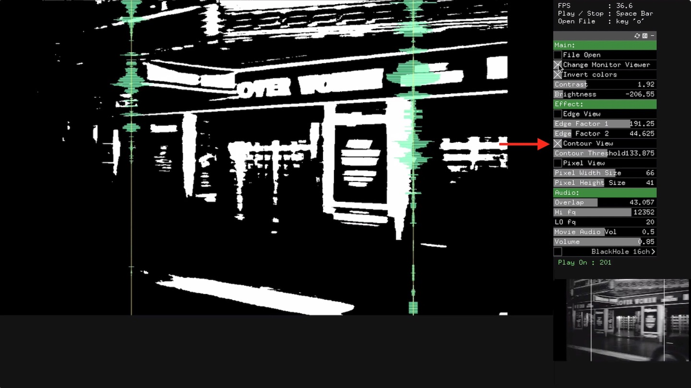
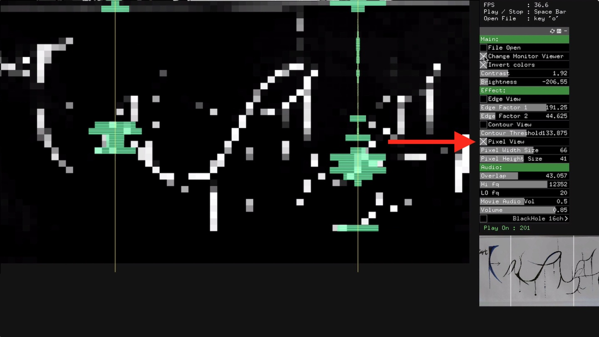
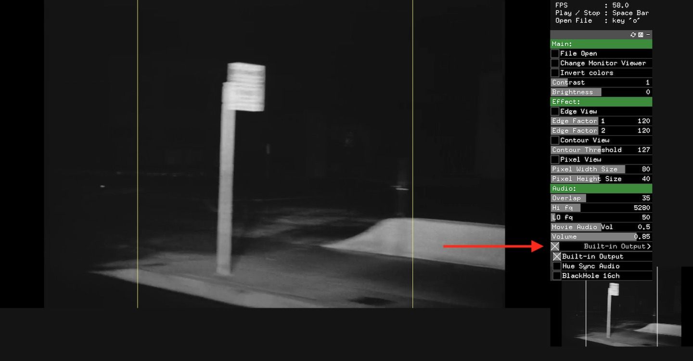

# Sketch Synth Video

<b>v0.0.2 Download (Mac OS Catalina - 10.15.5 / Windows 10)</b> : [SketchSynth Video Simple](https://github.com/jeonghopark/SketchSynthVideo-Simple/releases)						

## Update !!!
Drawable trigger line
Editable trigger line

1. Make a trigger line by mouse click
2. Edit the edit points of the trigger line
3. Use "Delete - key" keyboard is for removing the last point.

         

         

         

         

        

[Testing SketchSynth Video Version #1. Youtube](https://www.youtube.com/embed/SqY2iRIYjlY)        
[Testing SketchSynth Video Version #2. Youtube](https://www.youtube.com/embed/2jNWzR8PiiM)		

		

## Description						
A video version of SketchSynth. (<a target="_blank" href="https://github.com/jeonghopark/SketchSynth-Simple">SketchSynth Github</a>) It behaves like Sketchsynth and can import video files. Video format should be mp4 or mov. Changing the effect of the video creates other sound patterns.        

- Import a video (mov or mp4, A shortcut key is 'o')      
- Press "space bar" to generate a sound play or pause.      
- Change the contrast and brightness parameters for better detections      
- Optional effects are Edgeview, Contourview and Pixelview        
- Choosable for audio out devices           

## Support				
If you like this experiment development, please support me.
<link href="https://fonts.googleapis.com/css?family=Arial" rel="stylesheet"><a class="bmc-button" target="_blank" href="https://www.buymeacoffee.com/c4KbpP0oa">Buy me a coffee</a>

## Links
<b>v0.0.2 Download (Mac OS Catalina - 10.15.5 / Windows 10)</b> : [SketchSynthFilm-Simple](https://github.com/jeonghopark/SketchSynthVideo-Simple/releases/tag/v0.0.2)					
			

				
## Source code     					

!!! I'm an artist working with code. Not a real programmer. Maybe the source code is unusual. But it works. :-).            

It's made with openFrameworks C++ framework. - <a target="_blank" href="https://openframeworks.cc">https://openframeworks.cc</a>

## Upcoming features
- User interface	
- More video effects		
- Video speed

					

## Contact		
Mail: jeonghopark (at) jeonghopark.de             
<a target="_blank" href="https://jeonghopark.de">https://jeonghopark.de</a>             
©2020 JeongHo Park             
